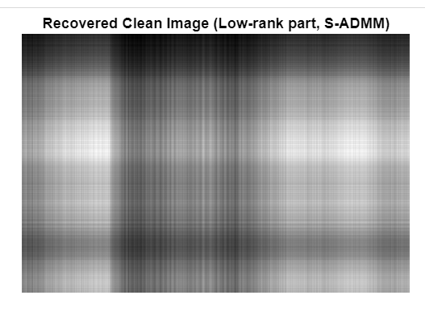
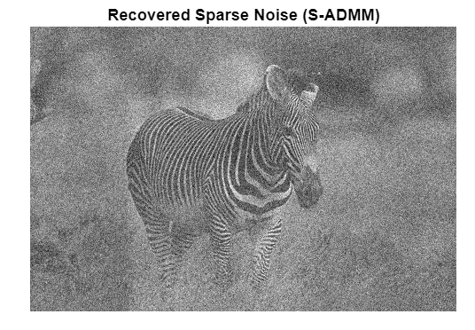
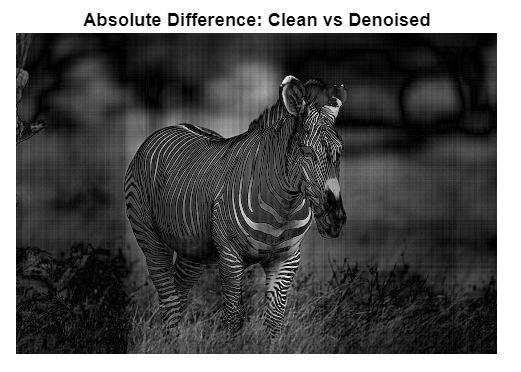
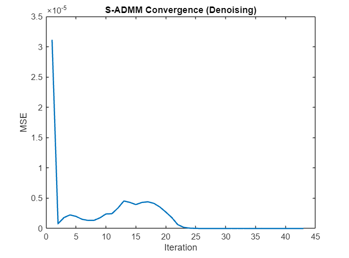
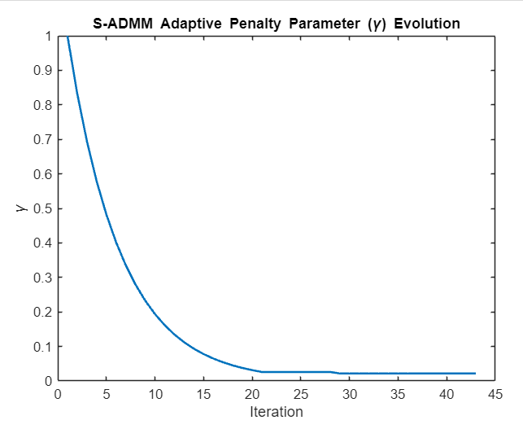

# MFC3_C14_ADMMDenoise

---

# Project Title

## Sparse Image Denoising using Self-Adaptive ADMM

---

## Member Details

## Team C-14

* **Jignesh Sudheer**
  Roll No: CB.SC.U4AIE24222

* **Sharavn RM**
  Roll No: CB.SC.U4AIE24253

* **Bhadhresh R**
  Roll No: CB.SC.U4AIE24208

* **Gautham T**
  Roll No: CB.SC.U4AIE24264

---

## Introduction

Images acquired in real-world scenarios are often corrupted by noise during acquisition and transmission. This noise degrades visual quality and affects further image processing tasks.

The degradation model is given by:

$$
D = Z + X
$$

where

* $Z$ : original clean image
* $X$ : noise component
* $D$ : observed noisy image

Recovering the clean image from noisy observations is an inverse problem.

This project solves the denoising problem using a **low-rank and sparse decomposition framework** optimized using **Self-Adaptive ADMM (S-ADMM)**.

---

## Objective

The objective of this project is to implement an S-ADMM based image denoising algorithm that separates a noisy image into its low-rank (clean image) and sparse (noise) components. The algorithm is evaluated using standard image quality metrics such as MSE, PSNR, and SSIM.

---

## Motivation / Why the Project is Interesting

Image denoising is a fundamental problem in image processing and computer vision. Traditional filtering methods often blur important details.

This project is interesting because it:

* Uses **optimization-based reconstruction**
* Separates noise explicitly instead of smoothing
* Applies **advanced ADMM framework**
* Incorporates **adaptive parameter tuning**

---

## Mathematical Formulation

The denoising problem is formulated as:

$$
\min_{Z, X} |Z|** + \lambda |X|*{2,1} \quad \text{subject to} \quad D = Z + X
$$

where

* $|Z|_*$ : nuclear norm promoting low-rank structure
* $|X|_{2,1}$ : column sparsity norm
* $\lambda$ : regularization parameter

---

## Methodology

### Mathematical Techniques Used

* Low-rank matrix approximation
* Nuclear norm minimization
* $\ell_{2,1}$ norm sparsity
* Alternating Direction Method of Multipliers (ADMM)
* Singular Value Decomposition (SVD)

---

## ADMM Formulation

### Augmented Lagrangian

$$
\mathcal{L}(Z, X, Y) = |Z|** + \lambda |X|*{2,1} + \langle Y, D - Z - X \rangle + \frac{\gamma}{2} |D - Z - X|_F^2
$$

---

## Derivation of Update Steps

### 1. Z-Update (Low-rank Component)

$$
Z^{k+1} = \arg\min_Z |Z|_* + \frac{\gamma}{2} |Z - A|_F^2
$$

Using Singular Value Thresholding:

$$
Z^{k+1} = U , \text{diag}(\max(\sigma - \tfrac{1}{\gamma}, 0)) , V^T
$$

---

### 2. X-Update (Sparse Component)

$$
X^{k+1} = \arg\min_X \lambda |X|_{2,1} + \frac{\gamma}{2} |X - B|_F^2
$$

Column-wise shrinkage:

$$
X_i = \max\left(1 - \frac{\lambda}{\gamma |B_i|_2}, 0\right) B_i
$$

---

### 3. Dual Variable Update

$$
Y^{k+1} = Y^k + \gamma (D - Z^{k+1} - X^{k+1})
$$

---

### 4. Adaptive Parameter Update

$$
\gamma =
\begin{cases}
(1+\rho)\gamma, & \text{if ratio} > 1+\rho \
\gamma/(1+\rho), & \text{if ratio} < \frac{1}{1+\rho}
\end{cases}
$$

---

## Working of the Algorithm

* The noisy image is split into two components
* The low-rank part captures structure
* The sparse part captures noise
* ADMM solves the problem iteratively
* Adaptive $\gamma$ improves convergence

---

## Results & Discussion

## Evaluation Metrics

Mean Squared Error:

$$
MSE = \frac{1}{N}\sum (Z - Z_{rec})^2
$$

Peak Signal-to-Noise Ratio:

$$
PSNR = 10\log_{10}\frac{MAX^2}{MSE}
$$

Structural Similarity Index (SSIM) is also used.

---

## Results Observed

* Noise is effectively separated from the image
* Denoised image preserves structure
* Convergence is stable across iterations
* Adaptive parameter improves performance

---

## Results and Plots

## Denoised Output

## Noise Component

## Difference Image

---

## Convergence Plots

  
  

---

## Project Summary

| Component    | Description             |
| ------------ | ----------------------- |
| Problem      | Image denoising         |
| Model        | $D = Z + X$             |
| Method       | S-ADMM                  |
| Optimization | Nuclear norm + sparsity |
| Output       | Clean image + noise     |
| Metrics      | MSE, PSNR, SSIM         |

---

## Computational Performance

* Platform : Laptop
* Programming Language : MATLAB
* Execution Time : ~60 seconds

---

## Conclusion

This project implements an image denoising algorithm using the S-ADMM framework. The method effectively separates noise from the image by combining low-rank and sparse modeling. Experimental results show stable convergence and meaningful reconstruction, demonstrating the effectiveness of optimization-based denoising techniques.

---

## Future Plans

* Improve PSNR using parameter tuning
* Use faster SVD methods
* Extend to video denoising
* Compare with deep learning models

---

## References

* Li & Wang, Signal Processing (2026)
* ADMM Optimization Theory
* BSDS500 Dataset

---

## Repository Structure

* `s_admm_2.mlx` : MATLAB implementation
* `results/` : Output images and plots
* `README.md` : Documentation

---
